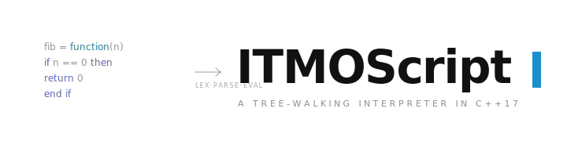

<div align="center">
    <picture>
    <source media="(prefers-color-scheme: dark)" srcset="banner-dark.svg">
    <source media="(prefers-color-scheme: light)" srcset="banner-light.svg">
    
    </picture>
</div>

> [English version](README.md)

[](https://en.cppreference.com/w/cpp/17)
[](https://cmake.org/)
[](LICENSE)

Динамически типизированный скриптовый язык с интерпретатором, написанным на C++17. Реализует полный конвейер обработки: **Лексер → Парсер → AST → Интерпретатор** — с лексической областью видимости, функциями первого класса, срезами списков и автоматическим управлением памятью.

## Язык

### Типы

`number` · `string` · `bool` · `nil` · `list` · `function`

### Синтаксис

```python
x = 10
y = x ^ 2 + 3 * x - 1     # ^ — возведение в степень

repeated = "ха" * 3        # "хахаха"

nums = [1, 2, 3, 4, 5]
print(nums[1:4])           # [2, 3, 4]

if x > 5 then
    print("большое")
else
    print("маленькое")
end if

for i in range(0, 10, 2)
    print(i)               # 0 2 4 6 8
end for

fib = function(n)
    if n == 0 then return 0 end if
    a = 0
    b = 1
    for i in range(1, n, 1)
        c = a + b
        a = b
        b = c
    end for
    return b
end function

print(fib(10))             # 55
```

### Встроенные функции

| Функция | Описание |
|---------|----------|
| `print(x)` | Вывести значение с переносом строки |
| `len(x)` | Длина списка или строки |
| `range(start, end[, step])` | Сгенерировать числовой диапазон |
| `type(x)` | Вернуть имя типа в виде строки |

### Операторы

| Категория | Операторы |
|-----------|-----------|
| Арифметика | `+` `-` `*` `/` `%` `^` |
| Сравнение | `==` `!=` `<` `>` `<=` `>=` |
| Логика | `and` `or` `not` |
| Присваивание | `=` `+=` `-=` `*=` `/=` `%=` `^=` |

## Архитектура

| Модуль | Файл | Ответственность |
|--------|------|-----------------|
| Лексер | `lib/Lexer.h / .cpp` | Токенизация, ключевые слова, литералы |
| Парсер | `lib/Parser.h / .cpp` | Рекурсивный спуск, приоритет операторов |
| AST | `lib/AST.h` | Иерархия узлов |
| Value | `lib/Value.h / .cpp` | Динамическая обёртка типов |
| Environment | `lib/Environment.h / .cpp` | Таблица символов, цепочка областей видимости |
| Интерпретатор | `lib/Interpreter.h / .cpp` | Обход AST, выполнение |
| Builtins | `lib/Builtins.h / .cpp` | Стандартная библиотека |

Управление потоком (`return`, `break`, `continue`) реализовано через исключения C++.

## Сборка и запуск

```bash
git clone https://github.com/notakeith/itmoscript.git
cd itmoscript
mkdir build && cd build
cmake .. && cmake --build .

./bin/main путь/к/скрипту.is
./bin/main ../examples/fibonacci.is
```

## Тесты

```bash
ctest --output-on-failure
```

## Расширение для VSCode

Подсветка синтаксиса для `.is`: [itmoscript-syntax](https://github.com/notakeith/itmoscript-syntax).

## Требования

- C++17
- CMake 3.14+